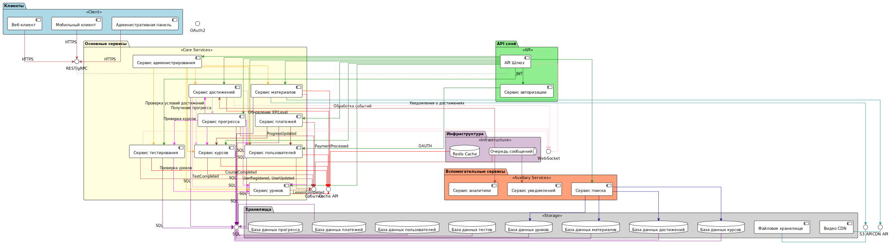

# 🏗️ Архитектура Keisenpai: Компоненты

## 🌐 Обзор архитектуры

### 🚦 Архитектурный ландшафт микросервисов

#### 📦 Компонентная структура проекта

| 🔍 Уровень | 🧩 Компоненты | 🌟 Описание |
|------------|--------------|-------------|
| **Клиенты** | 🖥️ Веб-клиент   📱 Мобильный клиент   🛠️ Административная панель | Точки взаимодействия пользователей с платформой |
| **API Слой** | 🚪 API Шлюз   🔐 [Сервис авторизации](https://gitverse.ru/shish/auth-service) | Централизованное управление запросами и безопасностью |
| **Основные Сервисы** | 👥 Сервис пользователей   📚 Сервис курсов   📝 Сервис уроков   🧪 Сервис тестирования | Ключевая бизнес-логика платформы |

## 🔬 Детальное исследование компонентов

### 1️⃣ Клиенты 🖥️
- **Веб-клиент**: 
  - 🌐 Основное веб-приложение
  - 💻 Адаптивный интерфейс
  - 🔒 Безопасное подключение

- **Мобильный клиент**:
  - 📱 Кроссплатформенное приложение
  - 🚀 Оптимизированная производительность
  - 🌈 Нативный UX

- **Административная панель**:
  - 🛡️ Расширенный контроль
  - 📊 Аналитические инструменты
  - 🔧 Управление системой

### 2️⃣ API Слой 🌉

#### 🚪 API Шлюз
- **Функции**:
  - 🔀 Маршрутизация запросов
  - ⚖️ Балансировка нагрузки
  - 🛡️ Первичная защита

#### 🔐 Сервис Авторизации
- **Ключевые возможности**:
  - 🔑 JWT-токены
  - 🛡️ Многофакторная аутентификация
  - 🔒 Управление правами доступа

### 3️⃣ Основные Сервисы 🧩

#### 👥 Сервис Пользователей
- 📋 Управление профилями
- 🏆 Отслеживание прогресса
- 🔐 Безопасность данных

#### 📚 Сервис Курсов
- 🗂️ Структуризация контента
- 📊 Адаптивное обучение
- 🧩 Модульность материалов

#### 🧪 Сервис Тестирования
- ✏️ Генерация тестов
- 📊 Оценка результатов
- 🏅 Адаптивная сложность

## 🌟 Преимущества архитектуры
- 🚀 Высокая масштабируемость
- 🔀 Гибкость компонентов
- 🛡️ Отказоустойчивость
- 📊 Распределенная обработка

## ⚠️ Замечания
- 🔄 Архитектура находится в активной разработке
- 🛠️ Возможны изменения и оптимизации

---
