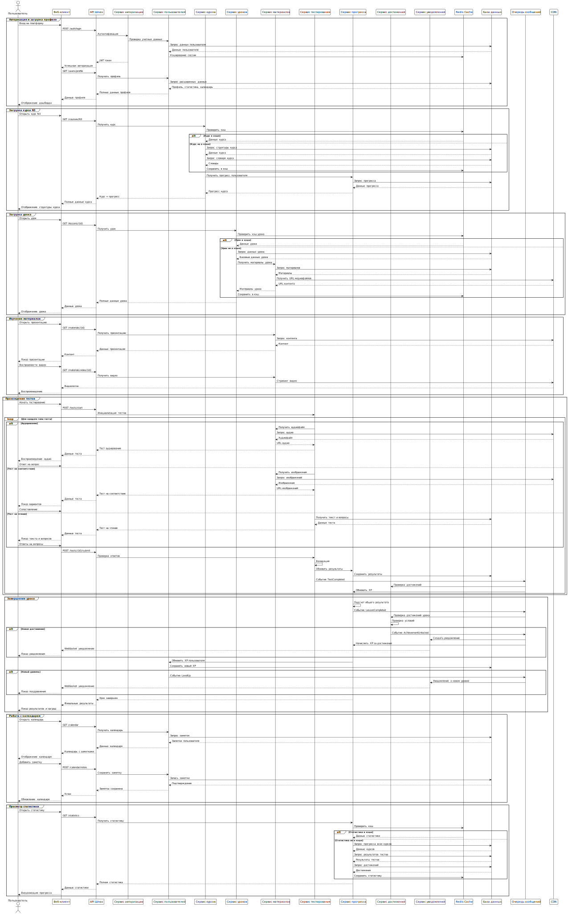

# 🔀 Диаграмма последовательностей Keisenpai


## 🌟 Визуализация взаимодействия сервисов



## 🎬 Ключевые сценарии взаимодействия

### 🔐 Сценарии взаимодействия

| 🏷️ Сценарий | 🔍 Описание | 🧩 Ключевые участники |
|-------------|-------------|------------------------|
| 👥 Авторизация | Вход пользователя в систему | Веб-клиент, API Шлюз, Сервис авторизации |
| 📚 Загрузка курса | Выбор и загрузка учебного курса | Сервис курсов, Кэш, База данных |
| 🧪 Прохождение теста | Выполнение тестовых заданий | Сервис тестирования, Сервис материалов, CDN |

## 🛠️ Редактирование диаграммы

### 📝 Работа с PlantUML

1. **Установка PlantUML**:
   - Онлайн-редактор: [PlantUML Web Server](https://www.plantuml.com/plantuml/uml/)
   - Локальная установка:
     ```bash
     npm install -g plantuml
     ```

2. **Редактирование кода диаграммы**:
   - Исходный код: `docs/SequenceDiagram.txt`
   - Изменить код диаграммы
   - Сгенерировать новый SVG

**Альтернативно**: Создать в любом рабочем пространстве диаграмму и прикрепить в документации ссылку к нему с **возможностью редактирования**.


### 🖼️ Генерация диаграммы

```bash
# Пример генерации SVG
plantuml SequenceDiagram.txt -tsvg
```

## 🔍 Детали взаимодействия

### 1️⃣ Авторизация и профиль
- 🔑 Проверка учетных данных
- 🎫 Генерация JWT токена
- 📊 Загрузка статистики пользователя

### 2️⃣ Работа с курсами
- 📥 Загрузка структуры курса
- 🗃️ Кэширование данных
- 📈 Отслеживание прогресса

### 3️⃣ Прохождение тестов
- 🧩 Генерация тестовых заданий
- 🌐 Загрузка мультимедиа
- 🏆 Обновление достижений

## ⚠️ Важные замечания

- 🚧 Архитектура в разработке
- 🔄 Возможны изменения в workflow
- 🤝 Открыты к предложениям

## 📄 Дополнительная документация

- [🏗️ Диаграмма компонентов](ComponentDiagram.md)
- [🤝 Руководство по участию](CONTRIBUTING.md)

